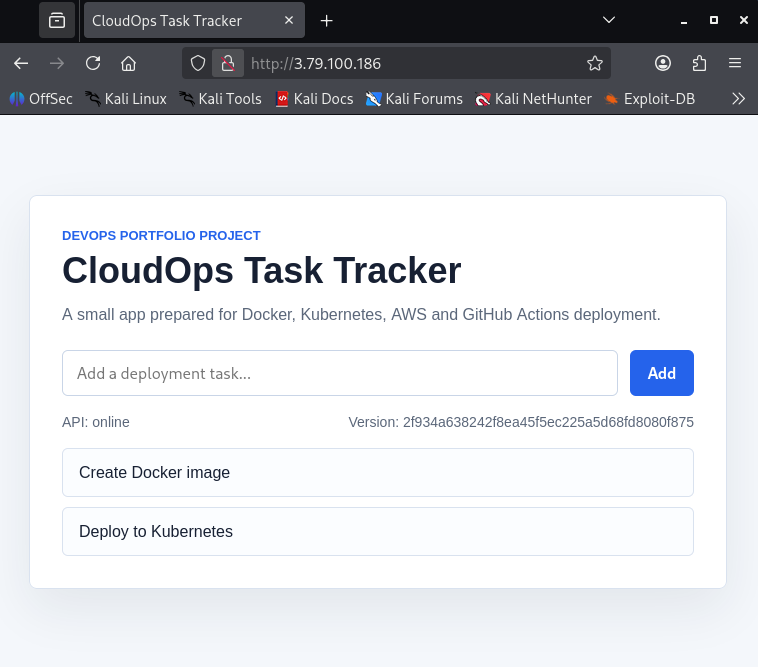
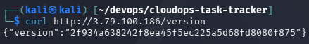
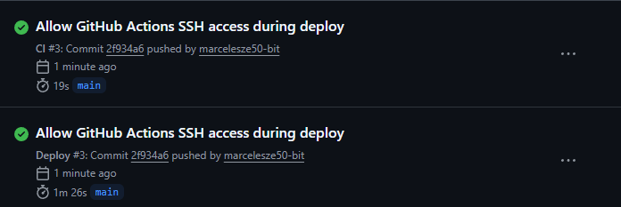
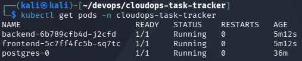
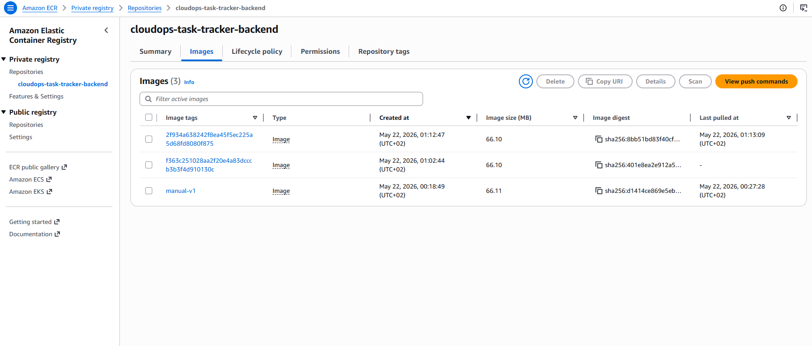
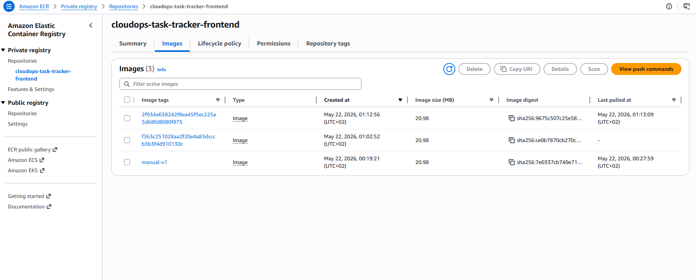

CloudOps Task Tracker
CloudOps Task Tracker is a junior DevOps portfolio project showing a complete path from local application development to automated deployment on Kubernetes in AWS.

The project uses a small task tracking application as the workload, but the main focus is the DevOps flow: Docker, Terraform, AWS, Kubernetes, Helm and GitHub Actions CI/CD.

Architecture
The application is deployed on a single-node Kubernetes cluster running on an AWS EC2 instance with k3s.

GitHub Actions
      |
      | build Docker images
      v
Amazon ECR
      |
      | deploy with Helm
      v
AWS EC2 + k3s Kubernetes
      |
      +-- Frontend: Nginx
      +-- Backend: FastAPI
      +-- Database: PostgreSQL StatefulSet

Infrastructure is provisioned with Terraform. Terraform state can be stored remotely in an S3 bucket with state locking enabled.

Tech Stack
AWS EC2
AWS ECR
AWS S3 remote Terraform state
Terraform
Docker
Docker Compose
Kubernetes / k3s
Helm
GitHub Actions
Python FastAPI
PostgreSQL
Nginx

What The Application Does
CloudOps Task Tracker is a simple task list application.

The frontend lets a user view and add deployment-related tasks. The backend exposes a REST API built with FastAPI, and PostgreSQL stores the task data.

Main API endpoints:
GET  /health
GET  /version
GET  /api/tasks
POST /api/tasks

The /version endpoint returns the application version. During CI/CD deployment, this value is set to the Git commit SHA, which makes it easy to verify which version is currently running in Kubernetes.

Features
FastAPI backend with health and version endpoints
Frontend served by Nginx
PostgreSQL database running in Kubernetes
Dockerized frontend and backend
Local development with Docker Compose
AWS infrastructure created with Terraform
Remote Terraform state in S3
Kubernetes manifests for manual deployment
Helm chart for reusable deployment
GitHub Actions CI pipeline
GitHub Actions CD pipeline deploying to Kubernetes
Docker images stored in Amazon ECR
Application version set from the Git commit SHA during deployment

## Screenshots

### Application

### Application Version

### GitHub Actions

### Kubernetes Pods

### Amazon ECR Backend Repository

### Amazon ECR Frontend Repository

cloudops-task-tracker/
  app/
    backend/
    frontend/
  infra/
    backend/
  k8s/
  helm/
    cloudops-task-tracker/
  docs/
    screenshots/
  .github/
    workflows/
  docker-compose.yml
  README.md

Local Development

Run the full application locally with Docker Compose:
docker compose up --build
Frontend:
http://localhost:3000
Backend API:
http://localhost:8000
Useful endpoints:
curl http://localhost:8000/health
curl http://localhost:8000/version
curl http://localhost:8000/api/tasks

Terraform Infrastructure

The Terraform code is split into two parts:
infra/backend
infra

infra/backend creates the S3 bucket used for remote Terraform state.

infra creates the main AWS infrastructure:
VPC
public subnet
Internet Gateway
route table
security group
EC2 instance
IAM role for EC2
ECR repositories
GitHub Actions OIDC role
k3s installation through EC2 user data

The main Terraform configuration provisions a single-node k3s cluster on EC2. This keeps the project cost lower than using a managed EKS cluster while still demonstrating Kubernetes deployment on AWS.

Terraform Backend

Initialize and apply the backend first:
cd infra/backend
terraform init
terraform plan -out=tfplan
terraform apply tfplan

Then initialize the main infrastructure:
cd ../
terraform init -reconfigure
terraform plan -out=tfplan
terraform apply tfplan

The main Terraform configuration uses an S3 backend with locking:
backend "s3" {
  key          = "cloudops-task-tracker/dev/terraform.tfstate"
  encrypt      = true
  use_lockfile = true
}

Docker
The application contains separate Dockerfiles for:

backend FastAPI service
frontend Nginx service

Docker Compose runs:
frontend
backend
PostgreSQL

This makes it possible to test the full application locally before deploying it to Kubernetes.

Kubernetes Deployment

The k8s/ directory contains raw Kubernetes manifests:
Namespace
ConfigMap
Secret example
PostgreSQL StatefulSet
Backend Deployment and Service
Frontend Deployment and Service
Ingress

Manual deployment can be done with:
kubectl apply -f k8s/namespace.yaml
kubectl apply -f k8s/configmap.yaml
kubectl apply -f k8s/postgres.yaml
kubectl apply -f k8s/backend.yaml
kubectl apply -f k8s/frontend.yaml
kubectl apply -f k8s/ingress.yaml

Helm Deployment

The Helm chart is stored in:
helm/cloudops-task-tracker

Deploy or update the application with:
helm upgrade --install cloudops-task-tracker helm/cloudops-task-tracker \
  --namespace cloudops-task-tracker \
  --set namespace.create=false \
  --set postgres.password=<password>
  
The Helm chart makes the Kubernetes deployment reusable and configurable. GitHub Actions uses Helm to deploy images tagged with the current commit SHA.

CI/CD Pipeline

The project contains two GitHub Actions workflows.

CI

The CI workflow runs on pushes and pull requests. It checks:
backend application import
Docker image builds
Terraform formatting
Terraform validation
Deploy

The deployment workflow:
Authenticates to AWS using GitHub OIDC.
Temporarily allows the GitHub runner to access SSH and the Kubernetes API.
Builds backend and frontend Docker images.
Pushes images to Amazon ECR.
Copies the k3s kubeconfig from EC2.
Deploys the application with Helm.
Verifies Kubernetes rollout.
Revokes temporary runner access from the security group.
No long-lived AWS access keys are stored in GitHub Secrets.

Security Notes

AWS access from GitHub Actions is handled through OIDC and IAM roles.
Terraform state can be stored remotely in an encrypted S3 bucket.
Sensitive local files are ignored by Git.
Kubernetes secret examples are included, but real secrets are not committed.
The GitHub runner receives temporary access to SSH and the Kubernetes API only during deployment.
Docker images are stored in private Amazon ECR repositories.

Cleanup
To remove the main AWS infrastructure:
cd infra
terraform destroy
The Terraform backend bucket is managed separately in:
infra/backend
Destroy it only when the project is no longer needed:
cd infra/backend
terraform destroy
If S3 bucket versioning is enabled, all object versions must be deleted before the bucket can be removed.

What I Learned

This project helped me practice:
building and containerizing a web application
provisioning AWS infrastructure with Terraform
using remote Terraform state
deploying applications to Kubernetes
packaging Kubernetes resources with Helm
configuring GitHub Actions CI/CD
pushing images to Amazon ECR
using GitHub OIDC instead of static AWS credentials
managing basic cloud security rules for deployment automation

